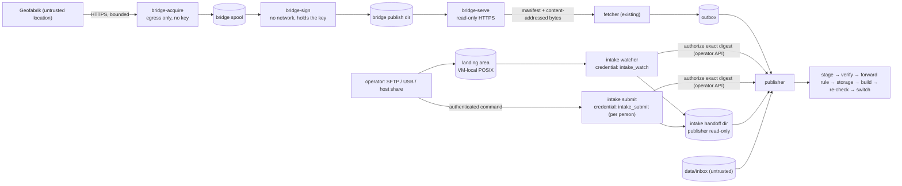

# ADR 0006: Stage 5, Iran hybrid intake

Status: proposed with the Stage 5 draft PR, 2026-10-03. Builds on
[ADR 0001](../architecture.md) and ADRs [0003](0003-stage2-publication.md),
[0004](0004-stage3-online-updates.md) and [0005](0005-stage4-operations.md);
the brief is [prompts/iran-hybrid-intake.md](../../prompts/iran-hybrid-intake.md).
It records stored-data migrations (registry schema versions 4, 5 and 6), additive
operator API changes, a tightening of manual activation, and two new trust
boundaries, as ADR 0001 requires before each. The public API is unchanged.

## Context

The owner selected Iran from raw OSM PBF with Geofabrik as distributor and
wants automatic publication once a complete file reaches the system, either
online (a controlled bridge checks Geofabrik and signs what it verified) or,
during an outage, by local delivery without the bridge or its key. After
acceptance both use the existing staging, verification, forward rule,
storage check, isolated build, validation, audited switch, retention and
rollback.

What the code did before this stage and the brief made explicit: the
operator `publish` scope (authorize, revoke, activate, online policy) is far
too broad for an unattended process; `registry.Authorize` superseded and
`Revoke` closed authorizations by digest, whoever created them; a manual
authorization was checked only when the staged copy was verified, never at
the switch; credentials were read only at publisher start; a PBF cut
between blobs passes the structural scan, so a watcher that hashes its own
truncated copy and writes its own marker proves nothing; `karta-sign` takes
its serial from the caller.

Nothing here is evidence about the owner's VM (tier C) or a production host
(tier D). Real key custody, the VM rehearsal and the production values are
deployment inputs (end of this ADR).

## Decisions

### Two intake boundaries, one publication path



| | Online (bridge) | Local intake | Direct inbox (fallback, unchanged) |
| --- | --- | --- | --- |
| What authorizes the digest | Ed25519 signature by a key pinned in the source file (ADR 0004) | an `intake_watch` or `intake_submit` authorization, bounded and owned | a region pin or a `publish`-scope authorization |
| Who decides "this file is the delivery" | the bridge, after its bounded acquisition and Karta's input checks | the producer's completion marker (watcher) or the named operator's expectation or attestation (command) | the operator who authorizes |
| Network | bridge: Geofabrik; fetcher: the bridge only | none (the `operator` network to the publisher) | none |
| Feed and scan order | online outbox, last | intake handoff dir, first | inbox, second |
| Provenance label | `online`, signed manifest and bridge sidecar | `intake`, channel and credential | `inbox` / `cli` |

The publisher remains the only process that verifies, builds and switches.
Neither new component has a database credential; the bridge never talks to
Karta; the intake talks only to the operator API.

### Local trust model

**Credential scopes.** Two new operator scopes, each of which must be a
credential's *only* scope (the credentials file refuses `intake_watch,publish`
and similar combinations, so a narrow credential is narrow by construction
and an older publisher refuses the unknown scope at start):

* `intake_watch`: the unattended watcher. Its authorizations are paused by a
  rollback (below).
* `intake_submit`: a named person running the command; one credential per
  operator gives person-level attribution in the audit log.

The channel is derived from the scope, never claimed in a request, so a
watcher token cannot present its deliveries as deliberate ones.

**Capability.** Both scopes reach only `/v1/operator/intake/*`:

* `POST /v1/operator/intake/authorizations` creates one authorization for an
  exact SHA-256 with a **required** size, for a handoff name of the caller's
  own channel (`w` watcher, `c` command), region and digest, a **required** lifetime
  (`ttl_seconds`; the publisher sets `expires_at` from its own clock) no
  longer than `KARTA_INTAKE_AUTHORIZATION_MAX_AGE`, the region the request
  names (refused unless it is the publisher's region), and the handoff name
  it will use. At most `KARTA_INTAKE_MAX_OPEN` (default 2) open, unexpired
  authorizations per credential. The same credential repeating the same
  digest, size and name gets its existing open row back (idempotent after a
  crash); a different size or name closes only that credential's own row.
  It never touches another principal's row. A handoff name is used once:
  a name that any authorization (of any credential, open or closed, however
  old) or intake submission already carries is refused
  (`handoff_name_taken`, changing nothing), and the intake then tries the
  next name (counter 1 to 99).
* `POST /v1/operator/intake/authorizations/{id}/close` closes one of the
  caller's own authorizations; another principal's id is `404`.
* `GET /v1/operator/intake/authorizations` lists the caller's own
  authorizations with the latest intake submission carrying each handoff
  name and recorded after the authorization was created: the narrow read
  the intake needs to follow its outcomes, nothing else (no audit, no other
  submissions, no releases).

Refused unless the publisher has the intake feed enabled (`KARTA_INTAKE_DIR`),
so a deployment that did not opt in accepts no intake authorization. Every
creation, close and refusal is audited with the credential name and channel.

**Ownership isolation (stored data).** Authorizations get a `channel`
(`operator`, `intake_watch`, `intake_submit`). Uniqueness is now one open
`operator` row per region and digest (the Stage 2 rule, unchanged for
operators) plus one open row per region, digest and *intake credential*.
`registry.Authorize` (publish scope) supersedes only `operator` rows. An
operator `revoke` (publish scope) still closes **every** open authorization of
the digest, intake ones included: it is the stop button and needs operator
authority. An intake credential can close only rows it created.

**Process.** The watcher runs from the distroless image as UID 65532, read-only
root, no capabilities, `no-new-privileges`, memory/CPU/PID limits, on the
`operator` network only (no route out, no database), with the landing area
mounted read-only and the handoff volume read-write. The command is a
one-off container of the same image with only the mounts it needs.

**Identity limits.** A SHA-256, a marker or file ownership does not identify a
person. The watcher's audit records the channel: credential name, landing
owner UID, file name, size, mtime and digest. Person-level attribution needs
the command (per-person credential) or the SSH logs of the landing account,
outside Karta. Root and members of the `docker` group can publish regardless
(Docker access is root-equivalent): they are inside the boundary.

**Turning it off.** Stop the watcher; close its open authorizations
(`karta operator revoke` per digest, or let them expire); remove its line
from the operator credentials. Operator credentials are now **reloaded when
the file changes** (as `metrics_tokens` already were): a removed credential
is refused at the next request without restarting the publisher, so a
running Iran build is not interrupted. A changed file that does not parse
**fails closed**: every authenticated operator request is refused (503
`credentials_unavailable`) until a valid file is in place, so a botched
edit cannot keep a removed credential alive. `scripts/gen-secrets.sh` now
rewrites `operator_tokens` in place (a bind mount keeps the original inode)
and keeps the extra credentials listed in `secrets/operator_tokens.extra`
(`scripts/operator-credential.sh` adds and removes them).

**Challenge: why not a publisher-native trusted folder?** A publisher feed
that trusts a landing directory needs no token and no extra process. It was
rejected: (1) the publisher parses untrusted PBFs and would also make the
trust decision about the folder, merging two boundaries; (2) the
authenticated command needs the narrow scope anyway, and one capability for
both keeps one audit trail; (3) an authorization row is a bounded, visible,
revocable, expiring record the switch re-checks, while a trusted feed's
authority is permanent and invisible; (4) the publisher would need read access
to arbitrary operator-controlled paths. The cost, a bearer token that together
with write access to the handoff directory is publication authority, is
handled like the signing key: one file, mounted only into the watcher,
revocable without a restart.

### Producer completion contract and landing preflight

**Landing files.** A delivery in the landing area is `NAME.osm.pbf`, an
optional `NAME.osm.pbf.provenance.json`, and the producer's completion marker
`NAME.osm.pbf.complete`, written **last** by an atomic rename:

```json
{"format": "karta-delivery/1", "file": "NAME.osm.pbf", "sha256": "<64 hex>", "size_bytes": 229580914}
```

The digest and size are computed by the producer **from its source copy
before the transfer** (on Windows: `Get-FileHash -Algorithm SHA256` of the
original file). The watcher refuses (and records why):

* no marker (`waiting_for_completion_marker`): a `.sha256` or `.md5` file is
  never a completion signal, so a self-made checksum of a truncated file is
  ignored;
* a marker older than the snapshot (`completion_stale`: the snapshot was
  replaced after the marker was written), for another file, malformed, too
  large (4 KiB) or not a regular file owned by the landing owner;
* a snapshot whose size differs from the marker (`size_mismatch`, no hashing);
* a snapshot whose digest differs (`digest_mismatch`), detected while copying;
* a change of either file during the settle interval (`settling`) or the copy
  (`changed_during_copy`).

The settle interval (`KARTA_INTAKE_SETTLE`, 10 s) is only an extra race check;
completeness comes from the independent digest. UTF-8 byte-order marks and
CRLF are tolerated and hex digits may be upper case (PowerShell output).

**Supported Windows-to-VM transfer.** OpenSSH `sftp` (built into Windows 10/11
and Server 2019+) as a dedicated landing account with per-person keys into a
VM-local landing directory: upload to a temporary name (a leading dot or
`.part`/`.filepart`, which the watcher ignores), `rename`, then upload and
rename the marker. `scripts/deliver.sh` does the same from Linux, macOS or
WSL (sftp or a local copy); the runbook gives the PowerShell steps. A
hypervisor or SMB shared folder is only an untrusted transfer space: from it,
use the command with an expectation.

**Command.** `karta intake submit FILE` requires an independent expectation
(`--expect-sha256`, optionally with `--expect-size`, or `--expect-file` with a
`karta-delivery/1` marker) or an explicit `--attest-complete` with a reason
(recorded as the named operator's attestation). It copies the file, hashing
it, from wherever it is (also an untrusted share), refuses a mismatch before
authorizing, and then follows the publication to its outcome.

**Landing preflight** runs before every watcher scan and as
`karta intake check` (which exits non-zero when it fails). Refused, with the
reason in the watcher state and the check output:

* the landing directory or a parent is a symlink; the landing directory is not
  owned by `KARTA_INTAKE_LANDING_UID`; it or a parent is writable by others, or
  by a group other than `KARTA_INTAKE_WRITER_GID`;
* a filesystem that is not on the local POSIX allow list (ext2/3/4, xfs, btrfs,
  zfs, f2fs, tmpfs). Shared-folder, FUSE (which includes virtiofs and
  vmhgfs-fuse), 9p/drvfs, SMB/CIFS, NFS, vboxsf, NTFS and FAT types are refused
  by name;
* per entry: symlinks, FIFOs, devices, sockets and directories (never opened),
  a link count other than 1, files not owned by the landing owner.

Inside a container the preflight sees the bind mount's real filesystem type,
owner and mode, but the host's parent directories are hidden;
`karta intake check --host-root /host` run with the host root mounted
read-only checks the host parents too (`make intake-check`). On failure the
watcher processes nothing (fail closed) and the command remains available.

### Handoff: a dedicated directory, intake first

The intake hands off into its own directory (volume `intake`), written only by
intake processes and mounted read-only into the publisher (`KARTA_INTAKE_DIR`),
with the unchanged inbox completion protocol (`.osm.pbf`, optional sidecar,
`.ready` marker last). Rejected: the shared `data/inbox`, where any writer can
collide with names or flood the scan beyond `KARTA_INBOX_MAX_ENTRIES` and so
stall the trusted path.

Scan order becomes **intake, inbox, online**. Manual-first is preserved (both
manual feeds precede online deliveries); the trusted feed goes first so its
queue is bounded by its own open-authorization limit and not by whatever the
untrusted inbox holds. Builds stay serialized by the build lock.

Handoff names are `<region>-<w|c><UTC time>-<digest prefix>` (watcher or
command), never reused or overwritten. The intake copies, hashing, from the
landing file or the command's input into a hidden temporary file in the
handoff directory: the handed-off bytes then belong to the intake and cannot be
changed by landing writers (a rename would keep the producer as owner, and
the landing mount is read-only for the watcher). The extra full copy is the
price of that boundary and is counted below. The intake deletes its handoff
files (marker first) and closes its authorization once the submission is
final. Landing files are left for the producer to remove; the watcher records
the fingerprints it consumed so it does not process them again.

### Ordering, crash recovery and orphans

Order: copy-and-hash into `.NAME.part` → rename to `.NAME.hashed` → advisory
header pre-check → **authorize** → rename to `NAME.osm.pbf` (and sidecar) →
`NAME.osm.pbf.ready` last. Authorizing before the marker avoids a wasted
staging copy, full scan and `rejected` record (authorization is checked after
the scan).

| Crash after | Recovery (at start and on every scan) |
| --- | --- |
| part of the copy | `.part` deleted; the landing entry is processed again |
| `.hashed`, before authorizing | no authorization of ours names it: deleted, processed again |
| authorizing, before the rename | `.hashed` exists and an own open authorization names it: completed only if the file still has the authorized digest **and** (watcher) the landing entry is unchanged; otherwise deleted and the authorization closed. Command orphans are always discarded (an attended re-run is cheap) |
| the rename, before the marker | as above, for the visible snapshot without marker |
| the marker | the publisher has it; outcomes are followed through the narrow read |
| an own authorization with no handoff file at all | closed (`orphan`) |

An intake that never returns leaves its authorization to expire. Failpoints:
`intake.after_hash`, `intake.after_authorize`, `intake.before_marker`,
`intake.after_marker`.

### Authorization is re-checked at the switch, for every manual path

Every automatic manual, command-line and intake activation now re-evaluates,
inside the pointer transaction, what admitted the snapshot: the region file
read then (a current pin) or an open, unexpired authorization covering the
digest and size. Otherwise the switch is refused: the submission is
`rejected` with `authorization_revoked`, `authorization_expired` or
`unauthorized_digest` (reason "at activation"), the release stays `ready`,
the pointer is unchanged, and the refusal is audited. The same three codes are
used when verification finds no covering authorization, so an expired queued
submission is visible as such.

Recovery: a fresh covering authorization makes the publisher re-evaluate that
submission automatically (as for `unauthorized_digest` since Stage 2). The
retry stages and verifies again; `importer.Build` finds the validated release
that was never activated and returns it without importing; the switch then
activates it. **No rebuild** (tested). An operator may also activate the ready
release explicitly (operator authority, no authorization needed).

This **tightens** Stage 2 behaviour for `publish`-scope authorizations and
pins: revoking a digest, or removing its pin, during a build now stops that
build's activation (before, only verification looked). Nothing else changes
for them; no stored data needs rewriting.

**Lifetime.** An intake authorization must outlive its submission's wait
behind a running build, its own publication and the allowed interrupted
retries. The cap defaults to
`(1 + KARTA_INTAKE_MAX_OPEN × KARTA_PUBLISH_MAX_ATTEMPTS) × KARTA_PUBLISH_TIMEOUT + 1 h`
(43 h with the provisional defaults); the queue is bounded because the intake
feed is scanned first and each credential holds at most
`KARTA_INTAKE_MAX_OPEN` open authorizations. A configured cap below that is
accepted but logged as a warning (queued submissions could expire). An
expired authorization is never renewed automatically: the operator delivers
again (a new marker or another command run).

### The content policy is bound to a release

Acceptance checks are deliberately not part of a release id (ADR 0003), so a
policy-only edit of the region file keeps the release. Before this decision,
nothing evaluated the checks in force for a release already built: the
existing-release shortcut of a resubmission (the build finds the release and
imports nothing) skipped validation, and an operator activation ran none. The
documented Iran procedure (a draft region with empty checks, an import with
`--no-activate`, the checks set from the measured import, then activation)
therefore activated a release that had passed only the empty draft checks. A
dry run of proposed checks by another tool is not Karta's validation and does
not count.

* **Policy.** The content policy is the region file's `min_counts`, searches
  and tiles plus a validation revision (`importer.ValidationRevision`,
  changed whenever a check's meaning changes), bound to the region identity
  the checks are evaluated for (id, name, box, view centre and zoom, the
  region-file part of a release id, encoded losslessly), identified by a
  SHA-256 over a canonical encoding (`importer.PolicyOf`; absent and empty
  checks are one policy). A pass therefore stands for that exact identity
  only: an edit of the name, box or view alone, with the checks unchanged,
  makes every recorded pass not current, so a forward activation of a
  release built for the old identity is refused, and such a release cannot
  be revalidated against the file either (the identity check below): it is
  a new build. Restoring the identity makes the pass current again.
  `max_drop_fraction` is not part of the policy: it is relative to the
  release active at a switch and is judged again at every forward switch.
* **Binding.** A build records the policy it validated with the release
  (`registry.releases.validation_policy_sha256`, and the evaluation in
  `validation`) and in its import report (`validation_policy`).
* **Gate.** Every forward activation requires the target to have passed the
  policy of the region file read for that switch, checked in
  `registry.Activate`'s `Allow`, which reads the region file there, under the
  pointer lock and with the target row locked: the automatic switch of a
  publication (for this gate and the row-count gate), operator `activate`,
  and a rollback to a release that was never active. Otherwise the switch is
  refused with `validation_required` and nothing changes; a region file that
  cannot be read or parsed refuses it (`region_config`). A rollback to a
  release that was active before is not held up by a policy changed since:
  it is the way back. A roll-forward to such a release is an activation and
  is held to the policy in force.
* **Revalidation.** An existing release (ready, retired or active) is
  evaluated with the code a build uses: `min_counts` on the row counts
  recorded at its build (the database is immutable), and the tile layer
  contract, configured tiles and searches against its database, on a
  read-only session. It requires the configured region, this build's schema
  and style revisions, the checks the API applies before serving (release
  id, schema major, style, toolchain: `release_incompatible`), and that the
  release database records the region identity of the region file (id, name,
  box, view) and this build's revisions (`release_not_revalidatable`
  otherwise: publish the snapshot again). The policy it records is the one
  it evaluated, read once at the start. Results are written only to the
  registry. It never rebuilds and never activates. It runs as the operator
  action `POST /v1/operator/releases/{id}/revalidate` (scope `publish`), and
  on a resubmission of a built, never activated release that has not passed
  the policy in force, before anything else.
* **One evaluation per release.** An evaluation takes a session-level
  advisory lock keyed by the release id on a registry session of its own,
  without waiting, and records its outcome on that session: a second
  evaluation of the release, in any publisher or importer process, is
  refused at once (`409 revalidation_in_progress` with `Retry-After`; a
  resubmission ends `interrupted` with that code, exit 7). It is never
  queued, so a long evaluation cannot pile others up behind it. Different
  releases may be evaluated side by side (at most one each). The lock goes
  with its session, so a process that dies during an evaluation does not
  leave the release locked. It does not hold up an activation: the gate
  decides on the recorded outcome.
* **Interrupted evaluations.** Nothing is recorded with the release unless
  every check ran: an evaluation cut short by the request deadline, a
  cancellation or a lost connection to the release database is an error
  (`timeout` or `service_unavailable` for the operator action, `interrupted`
  for a resubmission), audited as a failed `revalidate` action, and leaves
  the release as it was. The checks are bounded by the request deadline
  (`KARTA_OPERATOR_REQUEST_TIMEOUT`, or the publication deadline on a
  resubmission), on the server too: pgx asks the server to cancel a
  statement the deadline interrupts, and the revalidation session's statement
  timeout (the time left until the deadline) stops it even if that request
  cannot be delivered. A result is recorded only with a `release_revalidated` audit record of
  the same request. A completed evaluation reports and records how long it
  took (`duration_seconds`). The operator timeouts for a large region are set
  from that measurement, not from the defaults (not shown sufficient for
  Iran) nor from an import report's `validate` time, which was taken under
  the build's own policy and bounds neither way an evaluation under another
  (runbook, "Measured-timeout gate").
* **Recording.** A pass makes the policy the release's. A failure under the
  policy the release passed withdraws that pass (fail closed); a failure
  under another policy keeps an earlier pass. Each evaluation is one update
  of the release row and one audit record (`release_revalidated`, with the
  policy, kind and failed checks) in one transaction.
* **Concurrency.** The record takes the release row's lock, as
  `registry.Activate` does, so an activation and a revalidation of one
  release are serialized: an activation that arrives while an evaluation is
  being recorded waits and decides on its outcome; a record that arrives
  while an activation that already passed the gate commits lands after it
  (the activation stands; the record is audited after it). An activation
  never waits for an evaluation still running: it is refused until a pass is
  recorded. Revalidation takes neither the build lock nor the pointer lock.
* **Changed policy.** A release whose recorded pass is of another policy is
  refused activation until revalidated. A policy changed during a build
  leaves the built release `ready` (`validation_required`); restoring the
  policy it passed makes it activatable again.
* **Failed revalidation.** The release stays as it is, is never activated by
  it, and cannot be activated under that policy; a resubmission ends
  `failed` (`validation_failed`, exit 5). Nothing is rebuilt or dropped.
* **Storage admission on reuse.** The capacity check now runs under the
  build lock once the release id is known, and only for a new import
  (`importer.BuildOptions.Admit`): a resubmitted built release is not refused
  for room it does not need. The candidate created to derive the id is
  counted once (the estimate includes it). A new build is refused as before
  (`rejected`, `insufficient_storage`), after waiting for the build lock
  instead of before.
* **No activation by default.** A resubmission with `--no-activate` (or
  with automatic activation off) revalidates and stays `ready`; a
  revalidation never activates.
* **Provenance.** The import report names the policy its checks evaluated;
  the registry keeps the latest evaluation (policy, outcome, kind, time,
  actor, source, failed checks), shown in the operator status with whether
  each release passed the policy in force; the audit log has
  `import_validated` (with the policy digest) and `release_revalidated`.

Tests: unit (the policy digest and its identity binding, the gate and the
status under an edit of only the name, box or view, the identity check, the
operator timeouts and the runbook's statement of their boundary, the
operator endpoint and its `revalidation_in_progress` answer), PostgreSQL (recording,
the version 6 upgrade preserving every row, an activation and a revalidation
of one release in both orders, and the per-release lock across sessions,
including one that ends holding it), and `TestReadyReleasePolicy` against
the stack (empty draft checks, a policy-only edit, refused activation and
rollback, a failed revalidation, a second evaluation through the API and
from a command-line process refused while one waits in the database, that
one ending at the request deadline with nothing recorded and its statement
stopped on the server, a process killed holding the lock, a resubmission
without a rebuild under a 1 MiB storage budget, an edit of only the name, box
or view refusing activation and a rollback to the never-activated release
and leaving the pass not current, activation after a pass, the rollback
exemption and the roll-forward rule (also after a rename), and a policy or a
region name changed during an automatic publication's build).

### A rollback pauses the watcher, not deliberate deliveries

A rollback now pauses, in its own transaction, automatic activation of online
snapshots (Stage 3) **and of submissions admitted only by `intake_watch`
authorizations** (`registry.intake_policy`). While paused they are still
staged, verified, built and kept `ready` (`intake_activation_paused`), so
unattended automation never undoes an operator's rollback. A deliberate
`intake_submit` delivery by a named operator, an operator authorization or a
pin is not paused: that is how an authenticated command resumes publication.
The watcher itself resumes only by an explicit, audited
`karta operator intake-resume` (`publish` scope); `intake-pause` pauses it.

### Bridge topology and signer isolation

The bridge is three processes of one binary (`karta bridge acquire|sign|serve`,
the distroless image), configurable as **co-located** (Compose file
`compose.bridge.yaml` beside Karta) or on a **separate host** (the same file
there; Karta's fetcher keeps its `egress` network to reach it):

* **acquire**: the only process with a route to the internet (its own network,
  destination policy, no key, no listener). It downloads into its spool.
* **sign**: `network_mode: none`, the only holder of the signing key. It reads
  the spool read-only and re-reads the bytes itself: SHA-256, the complete PBF
  scan, region box and data timestamp (`importer.Verify`, as `karta-sign`), then
  signs. It logs every signature, refuses a different snapshot that is not
  newer than the last one it signed, and writes only the publish directory and
  its own state volume.
* **serve**: read-only HTTPS of the publish directory to the fetcher (no key, no
  egress), `GET`/`HEAD` of the manifest and content-addressed files only.

A compromised downloader can feed bytes to the signer but cannot exfiltrate the
key, and the signer signs only what passes Karta's own input checks and its
newer-than rule; a compromised server can withhold but not alter (signatures).
That meets the brief's bar for a separate signer. Co-located, the fetcher
leaves the `egress` network and joins only the internal `bridge` network
(`allowed_networks`, `ca_file`): **no Karta process keeps an internet route**.
Neither topology adds a Karta-to-bridge connection besides the fetcher's.

Keys: CI generates throwaway keys at test time; a VM rehearsal generates a key
on the VM labelled as test material and never reused; the production key and
its custodian are an owner decision. Rotation is ADR 0004's (two keys
configured during the overlap: the signer signs with every configured key).

### The online new-version algorithm

Per check (`poll_interval`, initially **6 h**):

1. Hints: `HEAD` of the snapshot URL (`ETag`, `Last-Modified`,
   `Content-Length`) and, if configured, the distributor's `.md5` file. Hints
   are advisory and may be missing or stale.
2. No full download if every available hint equals the last acquisition's
   **and** the last full-byte verification is younger than
   `reverify_interval` (initially **7 d**). Without any hint, only the
   re-verification schedule downloads.
3. Otherwise download the whole file (bounded: `KARTA_MAX_INPUT_MB`, the
   source's `Content-Length`, `download_timeout` 2 h, `stall_timeout` 2 min),
   hashing SHA-256 and MD5. An interrupted transfer resumes only with a strong
   `ETag` sent as `If-Range` and an exact `Content-Range`; otherwise it starts
   again (`iran-latest` can change during a transfer).
4. The `.md5` is fetched again after the download: if it changed, the file
   changed during the transfer and the bytes are discarded
   (`source_changed`); if the bytes do not match it, they are discarded
   (`distributor_checksum_mismatch`). MD5 only detects accidents; it
   authenticates nothing.
5. Bytes equal to the last acquisition: only the verification time is updated.
   New bytes: spooled with an acquisition record (URL, observation times, HTTP
   validators, MD5 result) and a marker, for the signer.

The signer then: new digest with a newer data timestamp → new serial; same
digest → nothing (or renewal); different digest with an equal or older
timestamp → **held** (reported, not signed; Karta's forward rule would refuse
it anyway).

HTTPS only, TLS verified, no redirects, no proxy, the destination policy of
ADR 0004 on every connection, a descriptive `User-Agent` (required), `429` and
`503` honour `Retry-After`, failures back off exponentially with jitter
(15 min to 6 h). Confirm Geofabrik's current download terms before enabling.

### Serial, state and reconciliation

The signer's state file (its own volume, written by temporary file, fsync,
rename and directory fsync) holds the **high-water serial** and, for the
newest serial, the exact asset digest and the exact envelope bytes.

1. Allocate `high_water + 1` and write the asset (content-addressed) first.
2. Persist the state with the new high-water and the envelope **before** the
   manifest becomes visible.
3. Replace `manifest.json` atomically.

A crash after (2) promotes that exact envelope at the next start (or, if it
expired meanwhile, renews under the next serial): a serial is never bound to
two envelopes. Several signatures in one second are just consecutive serials.

At every start the signer reconciles: the published manifest's serial must not
exceed the state's high-water (a state restored from an older backup, or lost,
**fails closed**: nothing is signed). The operator then restores a provable
high-water with `karta bridge sign --raise-high-water N --reason TEXT`: `N`
must be at least the published manifest's serial and should be at least the
serial Karta accepted (`online.verified.serial` in operator status); it can
only raise the mark. A clock earlier than the last `issued_at` also fails
closed (`clock_behind`). Serials stay at or below 999,999,999,999, the range
in which the fetcher's `%012d` delivery names sort in serial order; the signer
refuses to go beyond it (about 30,000 years at one signature a minute). Unix
seconds are not used as a safety argument.

### Publication, renewal and serving

Assets are written as `snapshots/<sha256>.osm.pbf` and its sidecar (temporary
file, fsync, rename, directory fsync) before the manifest names them, and kept
until every manifest naming them has expired; the current asset is always
kept. The manifest (`manifest.json`) is replaced atomically, so a reader sees
the old or the new one and never names a partial asset. `serve` answers
`Range` requests with a strong `ETag` (`"sha256:<digest>"`) through
`http.ServeContent`, so the fetcher's verified resume works.

Initial validity **7 d** (`max_manifest_validity` 8 d in the fetcher's source
file); the signer renews the held asset under a new serial when less than
**3.5 d** remain, independently of Geofabrik's reachability. Renewal does not
change the data timestamp, so staleness (from the data timestamp) still
shows old data as old. When a manifest lapses during an outage or a build, the
fetcher's existing re-delivery and the publisher's ready-release recovery
activate it after renewal (tested).

**Tuning method.** Measure on the target (tier C, then D): download time
`D`, publication time `P` and the outage length to tolerate. Keep
`validity ≥ D + 2P + margin` (the first delivery switches before expiry),
renewal at half the validity, `poll_interval ≤ KARTA_DATA_STALE_AFTER / 4`
and at least 1 h. Initial `KARTA_DATA_STALE_AFTER` proposal for an online
Iran deployment: **72 h** (two missed daily Geofabrik updates); the owner
approves the real value.

### Provenance

The signer writes a provenance sidecar (signed by digest in the manifest)
that passes Karta's sidecar checks and adds a `karta_bridge` object: bridge
id, the exact source URL, the HTTP validators, observation and download
times, the distributor `.md5` and whether it matched, the signing key ids and
software version. Karta keeps it verbatim with the release. It records what
the bridge observed; it is not Geofabrik's signature and not proof that the
OSM facts are right.

Local deliveries are labelled by source (`intake`), channel and credential
(`AuthorizedBy`: "intake_watch authorization N by local-intake"). A local
sidecar's claims stay claims (Stage 2). A manual digest equal to one the bridge
signed is reported in operator status as the same bytes as that online
delivery, which is evidence of identity, not of origin.

### Limits and copies

| Copy | Where | Bound |
| --- | --- | --- |
| bridge partial / spool | bridge spool volume | one partial plus the two newest acquisitions |
| bridge assets | bridge publish volume | current plus any still named by an unexpired manifest |
| fetcher outbox | `online` volume | two deliveries plus one partial (ADR 0004) |
| landing | landing directory | producer-managed |
| intake handoff | `intake` volume | `KARTA_INTAKE_MAX_OPEN` per credential |
| publisher staging | `staging` volume | one submission |
| release databases | PostgreSQL | active + retained + one candidate (ADR 0003) |

Every new process has memory, CPU and PID limits (acquire 256 MiB/0.5 CPU,
sign 512 MiB/1 CPU because it scans the PBF, serve 128 MiB/0.5 CPU, intake
256 MiB/0.5 CPU); hashing and copying stream in 1 MiB buffers; one
acquisition, one signature and one intake handoff at a time. A dynamically
growing virtual disk can report space its host lacks: capacity checks inside a
VM do not cover that (VM plan).

### Monitoring

Karta's own view of the bridge stays the fetcher's report plus data age
(ADR 0004). The publisher reads the watcher's state file in the handoff
directory, as it reads the fetcher's, and exports `karta_intake_*` gauges:
enabled, watcher state age, preflight result, waiting landing entries,
open intake authorizations, the watcher's activation policy and the last
outcome. New alerts: `KartaIntakeWatcherOverdue` (unless the watcher
recorded a clean stop, `stopped_at`), `KartaIntakePreflightFailing`,
`KartaIntakeDeliveryRefused`, `KartaIntakeActivationPaused` (only where a
watcher runs). A co-located bridge exposes its own metrics on
`bridge-serve` (separate listener, `status`-scoped credential) for a
Prometheus that is told to scrape it; its alerts (`KartaBridge*`) are in their
own rule group.

## Registry schema version 4 (stored-data migration)

* `authorizations.channel` (`operator` default, `intake_watch`,
  `intake_submit`) and `authorizations.intake_name`; the single open-row index
  is replaced by one for `operator` rows (region, digest) and one for intake
  rows (region, digest, creator).
* `submissions.source` and `audit.source` allow `intake`.
* `registry.intake_policy` (watcher automatic activation, per region).

Existing rows become `channel = operator`; no release database changes. A Stage
4 publisher refuses a version 4 registry (newer than it supports), the safe
outcome; a Stage 4 API reads it as before.

## Registry schema version 5 (stored-data migration)

* A unique index on `authorizations.intake_name` (rows with a name, open or
  closed): a handoff name identifies one authorization for good, so the
  records' submission-by-name lookup is never ambiguous.
* Rows that already share a name (possible only on a version 4 registry
  written by earlier Stage 5 code) cannot be attributed to one handoff: the
  migration closes all of them (keeping an existing revocation's details),
  renames all but the first to `<name>~shared-<id>` (no handoff name can
  carry `~`, so the publisher admits nothing under it and the intake ignores
  it), and records one `intake_name_deduplicate` audit entry per name.

A publisher of the version 4 code refuses a version 5 registry (newer than it
supports).

## Registry schema version 6 (stored-data migration)

* `releases.validation_policy_sha256` (the content policy the release last
  passed) and `releases.validation` (its latest evaluation, passed or not).
  See "The content policy is bound to a release".
* No backfill: which checks a release built before version 6 passed is not
  known, so it has none recorded and must be revalidated before a forward
  activation (an existing ready release, or a retired one an operator
  activates again). The active release keeps serving, and a rollback to a
  release that was active before is unchanged.

A publisher of the version 5 code refuses a version 6 registry (newer than it
supports). Restore checks compare against schema version 6.

The upgrade is one-way and the only rollback is a restore of a backup
verified to be pre-version 6 (`registry.before.json` and
`registry.after.json` at schema version 5, `MANIFEST` naming the deployed
commit), taken with the deployed build: every command of the version 6
build, `karta registry-summary` in `make backup` included, migrates the
registry when it opens it. No down-migration is provided or supported
(operations, "Images and upgrades").

## Operator API changes (additive)

New scopes `intake_watch` and `intake_submit`; endpoints
`/v1/operator/intake/authorizations` (`POST`, `GET`),
`/v1/operator/intake/authorizations/{id}/close`, and `/v1/operator/intake/pause`
and `/resume` (`publish`); error codes `intake_disabled`,
`intake_limit_reached`, `intake_refused` (409, with reason codes
`region_mismatch`, `too_large`, `validity_beyond_cap`) and
`credentials_unavailable`; reason codes
`authorization_revoked`, `authorization_expired`, `intake_activation_paused`;
status gains `intake`. Later: `POST /v1/operator/releases/{id}/revalidate`
(`publish`), the error code `release_not_revalidatable`, the reason code
`validation_required`, and release fields `validation_policy_sha256`,
`validation` and `validation_policy_current` (status `region` gains
`validation_policy_sha256`). The public API is unchanged.

## Failure modes

| Failure | Effect | Recovery |
| --- | --- | --- |
| Geofabrik unreachable, 429/503 | acquire backs off; the signer still renews the held asset | automatic; data ages visibly |
| Geofabrik serves bytes that change during a download | discarded (`source_changed`) | next check |
| Geofabrik changes its Iran boundary | the signer refuses (`region_mismatch`); local deliveries too | reviewed region-file change |
| changed bytes, equal or older timestamp | held, not signed; alert | inspect; nothing to undo |
| signer key missing or unreadable | nothing signed; manifests expire | restore the key file |
| signer state lost or older than the published manifest | signer fails closed | `--raise-high-water N` from Karta's verified serial |
| bridge down | manifests expire; local intake unaffected | restart; renewal re-delivers |
| landing preflight fails | watcher idle, reported | fix permissions/filesystem; use the command meanwhile |
| completion marker missing, stale or wrong | entry waits or is refused, reported | the producer re-delivers |
| intake authorization expires in the queue | `authorization_expired`, visible | deliver again |
| revocation during a build | release `ready`, pointer unchanged | authorize again: activates without a rebuild |
| rollback | watcher and online activation paused | `intake-resume`, `online-resume`, or a deliberate command |
| removed or broken credentials file | refused at once; a broken file refuses everything | fix the file; no restart |
| a flooded `data/inbox` | inbox scan fails; the intake feed is unaffected | clean the inbox |

## Consequences and limits

* Engineering feature implemented and tested with fixtures (tier A) only. No
  Iran PBF was obtained, no VM accessed, no production key created.
* The watcher's preflight sees only what the operating system reports; a
  writer boundary also depends on who holds the landing account's SSH keys, the
  `docker` group and root, which deployment controls decide.
* The bridge's acquisition trusts Geofabrik's TLS only for transport; a valid
  bridge signature means "these bytes passed the bridge's policy", nothing more.
* One region, one bridge source and one intake handoff directory per deployment.

Deployment inputs (open): the production signing-key custodian and when to
enable online updates; which hosts may run the watcher and who may write their
landing areas; whether every local delivery needs named-person attribution;
the production polling, validity, renewal and data-age values and the service
objectives; the fixed Iran PBF (exact bytes, digest, provenance) for the
region file and the VM rehearsal; authorization of a VM rehearsal plan; the
production host and the other Stage 4 owner inputs (docs/operations.md).

## Implementation notes (draft PR)

What the implementation settled within the decisions above, for review:

* **Packages.** `internal/intake` (preflight, landing scan, completion
  marker, handoff with crash reconciliation, watcher, command),
  `internal/bridge` (acquire, sign, serve, metrics), shared file helpers in
  `internal/safefile`; `cmd/karta` gains `intake watch|submit|check` and
  `bridge acquire|sign|serve|status`, with `operator intake-pause|intake-resume`.
* **Deployment.** `compose.yaml` gains the `intake` volume (read-only in the
  publisher, off unless `KARTA_INTAKE_DIR=/data/intake`), `intake-watch`
  (profile `intake`) and `intake-cli`; `compose.bridge.yaml` runs the bridge
  standalone or co-located (the fetcher then joins only `bridge`). Make
  targets: `intake-check`, `up-intake`, `intake-off`, `intake-submit`,
  `deliver`, `bridge-tls`, `up-bridge`, `bridge-status`,
  `bridge-raise-high-water`, `bridge-off`. Scripts: `operator-credential.sh`,
  `deliver.sh`, `gen-bridge-tls.sh`; `gen-secrets.sh` rewrites
  `operator_tokens` in place and merges `operator_tokens.extra`; the restore
  script also stops the watcher.
* **Watcher clean stop.** The watcher records `stopped_at` when it stops on a
  signal and clears it at its next scan, so a deliberately stopped watcher
  does not raise the overdue alert while a crashed or hung one does
  (`karta_intake_watcher_stopped`).
* **Signer staging.** The signer copies each spooled delivery into a private
  staging directory in its publish volume before it verifies and hashes it,
  so the downloader cannot change the bytes between verification and
  publication; the content-addressed asset is that copy.
* **Recovery after a raise.** After an older signer state is restored and
  the high-water serial raised, the signer adopts the published manifest
  as its current one when it is newer than the state (the publish volume is
  written only by the signer), so it renews what Karta sees and does not
  sign published bytes again; a restored pending envelope is published only
  if newer than the published manifest. No serial is reused or lowered
  (tested in unit tests and end to end).
* **Review fixes (before the PR).** An independent adversarial review of the
  code found, and this PR fixes, with regression tests:
  an intake authorization admitted the same digest through every feed (now
  `registry.AuthScope`: an intake row admits only the intake submission with
  its handoff name, every other feed and the online
  `require_operator_authorization` check accept operator rows only); the
  switch re-check read the authorization without a row lock (now `FOR
  SHARE`, and the intake policy row is created at start so a pause and an
  activation always meet on it); an operator revoke could be undone by a
  new intake authorization of the digest (now `registry.intake_blocks`,
  cleared only by an operator's authorize; `digest_revoked`); landing files
  writable by their group or others were accepted (`unsafe_mode`); a final
  API refusal was retried at every scan; visible handoffs of a removed
  credential stayed forever (now swept after twice the validity cap); the
  signer stopped renewing when one acquisition failed, never retried a
  failed publication while running, and could publish a restored older
  pending envelope over a newer manifest after a raise (now it reconciles
  with the published manifest and adopts it when it is newer), and two
  signers could share a state directory (now a lock, also for acquire);
  `bridge-serve` had no write deadline or concurrency bound.
* **Second review (owner's blockers).** Three more defects were fixed:
  (1) intake authorization, operator authorize and operator revoke of one
  region and digest are serialized by a transaction-scoped advisory lock
  (taken first; the intake then takes its per-credential lock), so an intake
  request that passed its block check before a revoke committed is closed by
  that revoke, never left effective; a deterministic PostgreSQL test holds
  the intake transaction after its block check
  (`internal/registry/serialize_db_test.go`, run by `make test-integration`).
  (2) The signer trusts a published manifest only after
  `online.VerifySignedBy` (a signature by one of its own keys, none claiming
  them without verifying, and the region's id and box; no validity window,
  since a publication found after a restore may have expired); anything else
  fails closed (`published_manifest_untrusted`), and so does a published
  manifest with the persisted envelope's serial but other bytes
  (`published_envelope_conflict`), at start and during a run.
  `online.ParseUnverified` is no longer used for any signer decision.
  (3) An intake authorization is bound to the handoff's channel as well as
  its name: handoff names carry the channel letter
  (`<region>-<w|c><UTC time>-<digest prefix>`), the API refuses a name of
  another channel, region or digest (`handoff_name_mismatch`), and the
  publisher admits an intake handoff only with an authorization of the
  channel its name says wrote it, so an `intake_submit` row can neither
  admit a watcher handoff nor lift the watcher's pause after a rollback
  (integration test with a paused watcher handoff, a separate submit
  credential and a submit row written past the API). CI on these fixes
  found a command rerun within the same second as its crashed run reusing
  the discarded handoff's name; since records find a handoff's submission
  by name, a name is now never reused (one that any of the credential's
  authorizations holds gets a counter, like one taken by files), and the
  command follows its own authorization id for the outcome (fixed-clock
  unit test).
* **Third review (owner's finding).** That fix was incomplete: the intake
  checked names only against files and the records its own credential can
  list (at most 50, closed ones for a week), while the records attach
  submissions by name without ownership. Two `intake_submit` credentials
  could use one name for one digest in one second once the first handoff's
  files were gone, and the second would then report the first's outcome and
  remove its own files; the allocator also returned its last candidate
  (`-99`) without checking it. Now the registry holds the invariant: schema
  version 5 adds a unique index on `authorizations.intake_name` (open and
  closed rows), and `AuthorizeIntake` refuses a name that any authorization
  or intake submission already carries, before it changes anything
  (`handoff_name_taken`, audited; a concurrent request of another digest
  with the same prefix meets the index and is refused the same way). The
  records attach only a submission recorded after the authorization was
  created. The intake treats `handoff_name_taken` as "try the next name"
  (the watcher's pending record follows the name), fails with an explicit
  error instead of returning a taken candidate when all hundred are taken,
  and moves and writes its handoff files without ever replacing one (link,
  then unlink; a marker is linked into place), so a file that appears under
  the chosen name is left alone and the handoff fails. Tests: PostgreSQL
  (another credential's closed and open name, a refusal that supersedes
  nothing, a name with a submission, a name outside the 50-record listing
  and older than a week, the index refusing a row written past the checks,
  submissions recorded before the authorization, the version 5 upgrade of
  rows that already share a name, and the channel binding with a submit row
  naming a watcher handoff, which the index now keeps out of the stack
  test), unit (every candidate taken through `-99` by files or refusals,
  a file planted under the chosen name, a taken name not in the listing,
  for the command and the watcher), and `TestIntake` with two submit
  credentials delivering the same bytes under a fixed clock
  (`KARTA_FAILPOINT_CLOCK`, a test facility like `KARTA_FAILPOINTS`) and
  API requests for another credential's open and closed names.
* **Evidence.** Tier A only: unit tests with race detection for every new
  package, script tests, promtool rule tests with negative controls, and
  `TestIntake` and `TestBridge` against the Compose stack (fixtures, the
  controlled HTTPS source as the distributor stand-in, keys generated per
  run). No Iran PBF, VM or production host was used.

