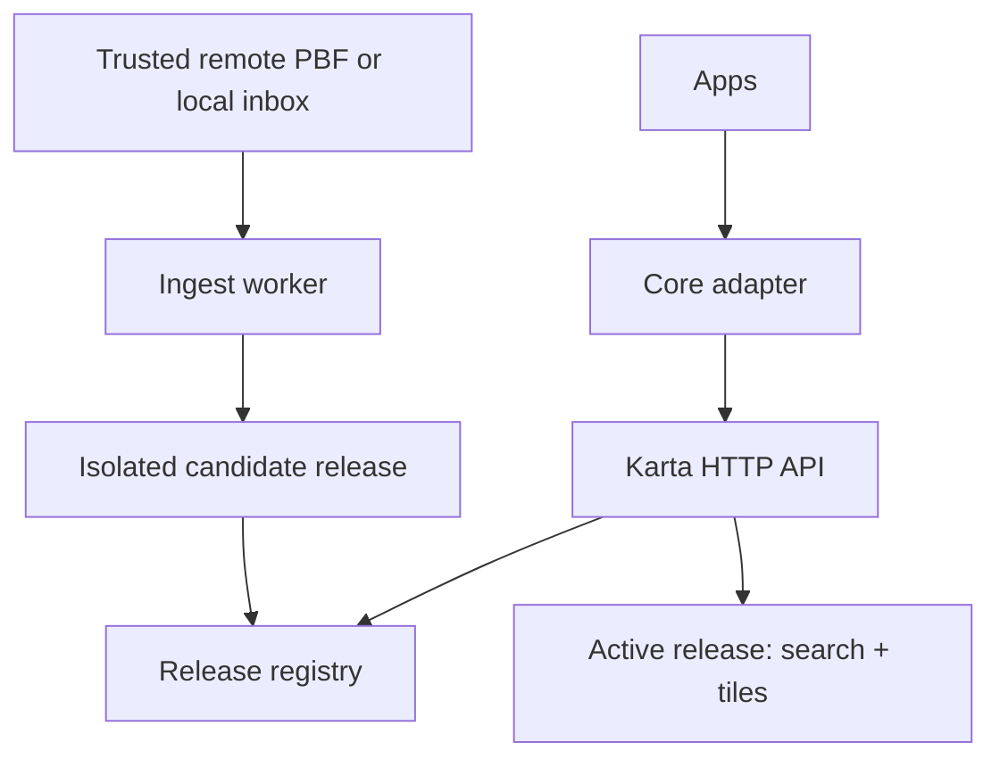

# Karta architecture baseline (ADR 0001)

Status: proposed baseline, 2026-09-28. This document is a contract for implementation and review, not a claim that code already exists.

## Scope and constraints

- MVP: self-hosted vector map, stable HTTP API, and search of named places/POIs, with offline runtime and automatic online or manual OSM snapshot imports.
- `apps -> core -> karta`: Karta owns geographic data and APIs. It must not know application-specific types, user accounts, or upstream project packages. `core` calls a versioned Karta API and can expose an adapter to apps.
- A *successful update* means a complete new release is validated and activated without stopping serving traffic. Internet failure must not prevent requests against the active release. A failed import never changes the active release.
- Address-level geocoding, routing, live editing, and planet-scale capacity are not MVP commitments. Place/POI search includes Unicode names and `name:fa`; ranking and language behavior require evaluation on the chosen region.
- Runtime host, hardware budget, QPS, acceptable staleness, and deployment topology remain configurable/open. Production geography is Iran from raw OSM data (owner decision, see [delivery plan](delivery-plan.md)), still configured per region rather than hard-coded. For development, use a deterministic committed fixture in CI and a real Chitgar Lake area extract from an Iran PBF for acceptance; see [development data](development-data.md). Neither the Tehran selection nor its raw data is hard-coded into production APIs.

## Feature completeness and evolution

Each accepted stage must deliver its **stated capability end to end**: input validation, secure request behavior, documented configuration, operational errors and diagnostics, positive and negative tests, restart and recovery behavior, and a real-data demonstration where applicable. A stage is not complete because its happy path runs. Stages add new capabilities across stable module and API boundaries; they do not postpone the quality of already shipped capabilities. This cannot eliminate future design changes, so capture a short ADR and migration plan before breaking a published API or changing stored release data. Keep map and named-place search deliberately bounded; full address geocoding and routing require separately specified feature contracts.

Explicit separation: generic region definitions and source adapters; isolated, versioned release builder; registry and activation; read-only query serving; tile/style asset serving; independent operator interface. Configuration must not contain credentials in source, paths must be restricted, database roles scoped, and public HTTP handlers must validate inputs and apply resource and timeout limits. Threat-model the inbox, download source, PostgreSQL access, caches, and operator actions before their respective features ship. Publish an OpenAPI schema and compatibility policy for the public contract; include any migration in the PR that changes it.

## System boundary

Use PostgreSQL/PostGIS and osm2pgsql flex to build release-specific search and vector tile tables. A self-hosted tile service such as Martin can read the PostGIS release database. Karta's API serves the manifest, place search, and version-pinned tile/style URLs; a self-hosted MapLibre client is an optional integration demo. Bundle style JSON, fonts/glyphs, sprites and JS/CSS locally. Do not assume that Martin alone supplies an attractive basemap: define and test the actual layers and style.

One immutable `release_id` identifies the PBF digest, source timestamp, region, import/style schema revision, software versions, data tables, search index, tile server instance, and static style assets. Keep the registry/control plane separate from release databases. No public API or tile path references mutable staging resources.

## Publication protocol

1. Discover an eligible source file, or accept one from the configured local inbox. Copy/download into a staging area and compute SHA-256. Only configured sources and expected `.osm.pbf` snapshots are accepted initially; enforce size/path limits and reject symlinks. Make duplicate digests idempotent.
2. Check that the PBF is complete and parseable, belongs to the configured extract/region, and has a valid data timestamp. Record provenance and reject a timestamp older than the active release unless the operator explicitly requests a rollback. File timestamps/ETags alone are advisory.
3. Acquire a per-region import lock. Create a new candidate database and import into it, never into the serving database. Build spatial/text indexes and a tile service against the candidate. Reserve CPU, RAM and disk so imports cannot starve serving.
4. Validate database integrity, region identity, representative tiles at multiple zoom levels, named-place search (including Persian when present), HTTP health, attribution, schema compatibility, and a minimum feature-count sanity threshold relative to the prior release. Thresholds must account for legitimate dataset changes and be operator configurable.
5. Commit a single active-release pointer in the registry after every component passes. Resolve the release once per request. Serve a manifest with version-pinned tile/style URLs; requests with an explicit release use only that release. Keep the prior release for a configured grace period, including long-lived clients and rollback, before safe garbage collection.
6. If any step fails, mark the candidate failed, expose the reason in status/metrics, keep the previous release serving, and allow an idempotent retry. Rollback changes only the active pointer to a still-retained, validated release; it does not mutate its contents.

Clients that need a consistent map and search session should pin `release_id` from `GET /v1/manifest` and pass it to search. Browser and intermediary caches must key tiles/styles by release ID. Atomic pointer activation covers publication, not host failure: high availability needs redundant serving nodes and a durable control plane.

## Online and offline inputs

Both inputs feed the same publication protocol; neither contacts a remote service on request paths. In online mode, poll only a configured HTTPS extract source, compare trustworthy source metadata, download to a temporary file, verify, and atomically publish the completed file to the staging queue. Network errors should affect only update status. In offline mode, watch a configured directory (including a user-chosen path literally called `name`, if desired) and periodically rescan it to recover missed file events. A producer should copy to a temporary name and rename to `*.osm.pbf` when complete; a `.ready`/checksum sidecar is recommended. For direct copies into a final name, wait for stable size and successful full-file validation before ingesting. Keep source digests and status to avoid repeats. (Implemented in Stage 3 as an opt-in, separate fetcher process that trusts only manifests signed by a pinned key and hands verified files to the publisher with the inbox protocol: [ADR 0004](adr/0004-stage3-online-updates.md).)

The first implementation uses complete PBF snapshots and independent shadow imports. Incremental `.osc.gz` replication can follow after its sequence continuity, extract/source compatibility, recovery behavior, and shadow-update resource model are tested. Never apply a sequence diff from a different extract or use an arbitrary newer PBF as an append diff. Snapshot rebuilding has a substantial disk/time cost; validate operational feasibility for the chosen geographic scale before claiming production readiness.

## API and operations contract

- `GET /v1/manifest`: active release ID, region, OSM data timestamp, style URL, tile template, attribution/license, capabilities, and freshness/status.
- `GET /v1/search?q=...&limit=...&release_id=...`: bounded place/POI search, stable response schema, coordinates, display name, category, matched language and release ID; reject unknown/expired releases explicitly. Parameterized queries and bounded input sizes.
- `GET /v1/releases/{release_id}/style.json` and `GET /v1/releases/{release_id}/tiles/{z}/{x}/{y}.pbf`: local, cacheable, release-pinned resources. Return a clear empty tile for no features and proper errors for unavailable releases.
- `/health/live` is process health; `/health/ready` requires a serving release and its data dependencies. An operator-only update/status/rollback interface must be authenticated and separate from public queries.
- Structured logs, a release/update state machine (`discovered`, `staging`, `validating`, `ready`, `active`, `failed`, `retired`), metrics for freshness, failures, duration, active release, request errors and disk space; alerts for prolonged staleness, no serving release and rollback failures.

The first running version may use one host with Docker Compose. Do not call it highly available. Define baseline performance and resource targets after the region and expected traffic are known. Cover restart after a failed import, simultaneous online/manual candidates, release pinning during switch, rollback, lost network, incomplete files, repeated files, and old-release cleanup in integration tests. Record disk/RAM/CPU usage when importing the real Tehran sample; estimate space for at least the active, candidate and retained release before accepting a production geography.

## Licensing and provenance

Show `© OpenStreetMap contributors` plus the ODbL link in every consuming map UI, and record origin/license per release. Keep third-party style/font licenses. OSM data may be used commercially under its license; OSMF public tile/geocoding servers have separate usage policies and are not Karta's offline serving tier. Review the legal implications of distributing derived databases with counsel if that becomes a product feature.

## Primary references

- https://www.openstreetmap.org/copyright
- https://operations.osmfoundation.org/policies/tiles/
- https://operations.osmfoundation.org/policies/nominatim/
- https://osm2pgsql.org/doc/manual.html
- https://docs.osmcode.org/pyosmium/latest/user_manual/10-Replication-Tools/
- https://github.com/maplibre/martin
- https://download.geofabrik.de/
