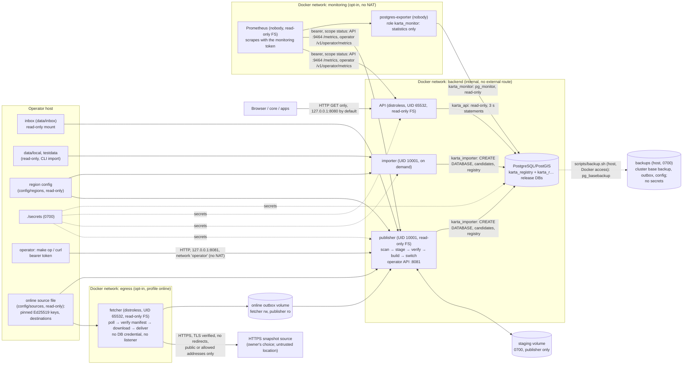

# Data flow, trust boundaries and security assumptions (Stages 4 and 5)

## Trust boundaries

| Boundary | Trusted | Controls |
| --- | --- | --- |
| Online source → fetcher | nobody: the source's location, TLS identity, file names and checksums prove nothing about the data | only the source file's `https` manifest URL and allowed hosts; every connection's resolved address checked (no loopback, private, link-local/metadata, shared, reserved, multicast unless in `allowed_networks`); TLS 1.2+ verified (system roots or the source's CA file only); no redirects; no proxy from the environment; bounded connect/handshake/header/total/stall times; manifest 64 KiB, sidecar 1 MiB, snapshot exactly its signed size (≤ `KARTA_MAX_INPUT_MB`), no decompression; manifest signature (pinned Ed25519 key), region, box, serial and validity verified **before** any download; downloads in a private 0700 directory, hashed, resumed only with `If-Range` and a full-file digest match; one check and one download at a time; backoff with jitter; outbox space reserve |
| Fetcher → publisher (outbox) | nobody: the fetcher faces the network and is treated as untrusted | the publisher reads the outbox read-only with the inbox protocol (marker, settle, `O_NOFOLLOW` copy into private staging) and then verifies the staged signed manifest itself: trusted key, region, box, validity, serial not lower than (or conflicting with) the newest one it verified (registry), staged snapshot and sidecar exactly the signed bytes, signed data timestamp equal to the derived one; the marker digest authorizes nothing; then all Stage 2 checks |
| Inbox → publisher | nobody: anyone who can write the inbox directory can submit files; nothing is imported unless its digest is pinned or authorized | read-only mount; completion marker required before any file is opened; names restricted; lstat only until then; symlinks, directories, devices, FIFOs rejected without opening; `O_NOFOLLOW\|O_NONBLOCK` open checked against the listed inode; settle interval; copy into a private 0700 staging volume with the digest compared to the marker and the source re-checked after the copy; bounded entry count, marker and sidecar sizes |
| Landing area → intake watcher (Stage 5, opt-in) | the landing owner and the writers the deployment admits: **write access to the landing area is publication authority** for any snapshot that passes the common checks while the watcher runs | off unless a deployment starts the watcher; landing preflight before every scan (local POSIX filesystem allow list, so shared folders, SMB, NFS, FUSE/virtiofs, 9p/drvfs and Windows filesystems are refused; owner `KARTA_INTAKE_LANDING_UID`; no write for others or for another group than `KARTA_INTAKE_WRITER_GID`; no symlinked directory or parent; host parents with `make intake-check`); entries only `lstat`ed until complete; symlinks, FIFOs, devices, sockets, directories, hard links, files of another owner and files writable by their group or others refused without opening; the **producer completion marker** (`karta-delivery/1`: digest and size computed from the source copy before the transfer) required, never a `.sha256`/`.md5`; marker newer than the snapshot; settle interval; `O_NOFOLLOW\|O_NONBLOCK` open checked against the listed inode; copied and hashed into the intake's own handoff directory, digest and size compared with the marker, the source re-checked after the copy; advisory header pre-check; only then an authorization; bounded entry count, marker (4 KiB) and sidecar (1 MiB) |
| Intake → operator API (Stage 5) | holders of an `intake_watch` or `intake_submit` credential, each that credential's only scope | one action: an authorization of an **exact digest with its required size**, for the publisher's own region (the request names it), with a required lifetime no longer than the publisher's cap (`KARTA_INTAKE_AUTHORIZATION_MAX_AGE`, derived from the publication deadline and retries), at most `KARTA_INTAKE_MAX_OPEN` open per credential; an intake authorization admits only the intake handoff it names (never the same bytes in the inbox, `karta import` or an online delivery); a digest an operator revoked cannot be authorized by the intake again until an operator authorizes it; it can list and close only its own authorizations; it cannot read status or audit, revoke or supersede any authorization, activate, roll back, clean up or change online or intake policy (403, tested); refused unless the intake is enabled (`KARTA_INTAKE_DIR`); every creation, close and refusal audited with the credential and channel |
| Intake handoff → publisher (Stage 5) | nobody: the intake is treated like the inbox | a dedicated volume written only by the intake processes and mounted read-only into the publisher, scanned before the inbox (a flooded inbox cannot stall it); the inbox protocol and every Stage 2 check; the authorization (or pin) re-checked inside the switch transaction |
| Distributor → bridge-acquire (Stage 5, opt-in) | nobody: Geofabrik's TLS, file names, ETags and `.md5` prove nothing about the data | the same destination policy as the fetcher (https only, resolved addresses checked, no redirects, TLS verified, no proxy), a descriptive `User-Agent`; `429`/`503` and `Retry-After` honoured; hints (HEAD validators, `.md5` before and after) only decide whether to download; bounded sizes and times; partial downloads private, resumed only with `If-Range` and a strong ETag; a bounded full re-verification schedule; no key, no listener |
| bridge-acquire → bridge-sign (spool) | nobody: the downloader faces the network | the signer has **no network** (`network_mode: none`), is the only holder of the key and runs as a single instance (a lock on its state directory); it reads the spool read-only, copies the bytes privately and verifies them itself with Karta's importer checks (SHA-256, the complete PBF scan, region box, data timestamp); it signs only data newer than the last it signed (different bytes with equal or older data are held and reported); serials come from durable state, with the exact envelope persisted before it is published; at start it reconciles with the published manifest (a pending envelope is published only if newer; a newer published manifest becomes the current one); every signature is logged |
| bridge-serve → fetcher | nobody: the bridge is one more signed source (Stage 3 checks) | read-only HTTPS of the publish volume (`GET`/`HEAD` of the manifest and content-addressed assets only), at most 16 requests at a time, a stalled response abandoned after a minute without progress, no key, no route out; co-located, the fetcher leaves `egress` and reaches only the bridge's no-NAT network |
| Snapshot bytes → verification and osm2pgsql | nobody until verified | only the staged copy is read; the whole PBF is scanned (every blob framed within 64 KiB/32 MiB limits, raw or zlib decoded to its declared size, protobuf structure walked, trailing bytes and history files rejected); region box; provenance digest/size/license/box/timestamps; trustworthy data timestamp (sidecar or header, consistent, not in the future); **SHA-256 pinned in the region file or authorized by an operator, or (online deliveries only) signed by a key pinned in the source file**; re-hashed after osm2pgsql; osm2pgsql as non-root in a read-only container with a tmpfs and no NAT route out (online updates do not change this: downloads run in the separate fetcher) |
| Source file → fetcher and publisher | operator (reviewed configuration) | strict JSON (unknown fields and repeated keys rejected), https-only URLs without credentials/query/fragment, 1–8 Ed25519 keys with ids, bounded intervals; region must equal the publisher's; read again for every check and delivery (a removed key stops being trusted without a restart) |
| Snapshot file → command-line importer | the operator who runs it (host shell) | same staging copy and verification as the inbox, without the marker |
| Region config → importer | operator | strict JSON (unknown fields rejected), validated ids/boxes/digests; identifiers are never interpolated from free text into SQL |
| Operator → operator API | holders of a token, by scope | separate process and port from the public API (no operator routes there); 127.0.0.1 only by default; bearer tokens of 256 random bits compared by SHA-256 in constant time; per-credential scopes `status`, `publish`, `rollback`, `cleanup` (and, Stage 5, `intake_watch` and `intake_submit`, each only alone); the credentials file is re-read when it changes (a removed credential is refused at its next request without a restart) and a file that does not parse refuses every request (`credentials_unavailable`) until fixed; `POST` bodies `application/json`, ≤ 16 KiB, strict (unknown fields rejected), reasons bounded; per-request timeout; `no-store`; every action and every refusal audited with the credential name (refusals rate-limited); tokens and bodies never logged |
| Publisher/importer → database | importer role | not a superuser: `CREATEDB` only; it owns the registry and the release databases it creates; PostGIS comes from a template created at initialisation; the audit table rejects updates, deletes and truncation by trigger (the owner could drop the trigger: this protects against mistakes and application bugs, not against a compromised publisher) |
| API → database | nobody: API input is untrusted | `karta_api` is a member of `karta_reader` with `CONNECT` + `SELECT`/`EXECUTE` only (registry: releases, active pointer and schema version; not submissions, authorizations or audit); sessions default read-only at the role, the release database and the connection; `statement_timeout` 3 s (connection) and 5 s (role); only parameterized SQL; release databases are frozen `default_transaction_read_only = on` after import; a release is served only while the serving toolchain equals the recorded one (checked on every new connection) |
| Client → API | untrusted | `GET`/`HEAD`/`OPTIONS` only, bodies rejected, 16 KiB header limit, 5 s header / 10 s read / request deadline, strict parameter validation (unknown or repeated parameters rejected, UTF-8 and control characters checked, bounded lengths and numbers), LIKE metacharacters removed by normalization and escaped again, errors without internal details, access logs without query strings |
| Monitoring → metrics | holders of the monitoring credential (scope `status`) | API metrics on a separate listener (`KARTA_METRICS_LISTEN_ADDR`), never the public one (`/metrics` there is 404); bearer token checked against hashes in `metrics_tokens`, re-read when the file changes (old token refused at once); refusals logged at most once a minute; bounded labels only (fixed route names, status classes, release ids, error codes: no paths, queries, client addresses or search terms); loopback by default, TLS proxy otherwise |
| Exporter → database | the exporter is trusted with statistics only | role `karta_monitor`: `pg_monitor`, `CONNECT` to `postgres` only, read-only sessions, 5 s statements, 3 connections; no table data; no route out (`monitoring` has no NAT) |
| Backups → their storage | whoever can read the backup directory | 0700 directory, 0600 files; secrets excluded (fingerprints only); `SHA256SUMS` and `pg_verifybackup` checked before a restore changes anything; the backup still holds password verifiers, the audit log and all data, so it must be encrypted and access-limited like the secrets |
| Backup → restored registry | the backup, after verification | restore order fixed (verify, secrets, a preflight that refuses before any change when the database volume (a cluster or partial files) or the outbox holds data without `--replace`, a full stop of the stack so nothing writes during the restore, database, passwords from current secrets, outbox, `restore-check`, serving); `restore-check` verifies schema, release databases (present, read-only), the active release, the append-only audit table, and that the restore lies between the summaries taken just before and just after the base backup (audit history, serials, releases, anti-replay floor; the pointer as the restored audit log's last switch leaves it); only then it pauses automatic online activation and audits the restored pointer (`restore`) in one transaction |
| Browser → demo | untrusted page context | CSP `default-src 'none'` with `script-src`/`connect-src` `'self'`, `frame-ancestors 'none'`; MapLibre and fonts served locally; no CDN, OSM tile or Nominatim access |

## Network exposure

* PostgreSQL publishes no port and sits on an `internal` network with no route
  outside Docker. The API is published on `127.0.0.1` by default
  (`KARTA_HTTP_BIND`) and the operator API on `127.0.0.1:8081`
  (`KARTA_OPERATOR_BIND`); put TLS termination in front of either for any
  other exposure, and expose the operator API only to operators.
* The publisher's extra network (`operator`) exists only to publish the
  operator port; it is a bridge with IP masquerading disabled, so the
  publisher (which parses untrusted snapshots) has no NAT route to outside
  hosts. This relies on Docker's bridge driver option; verify it on other
  runtimes.
* With online updates enabled (opt-in), the **fetcher** is the only
  container with a route out, on its own `egress` network; it is not on the
  backend network (no database access) and publishes no port. The publisher
  stays without a route out. `make test-integration` puts the fetcher on an
  internal network with only the local test source and checks its isolation
  with `scripts/check-isolated.sh`.
* The running API makes no outbound connections: it needs the database and
  nothing else, and keeps answering during an internet outage. `make
  test-offline` runs it with no external route. It checks the container's
  network attachments, the network's `internal` flag, published ports and
  default routes (`scripts/check-isolated.sh`, with a negative control on a
  frontend-like network), and checks the result from the browser's point of
  view too.
* The API's metrics listener (`:9464`) and the opt-in monitoring profile
  (exporter `:9187`, Prometheus `:9090`) publish on `KARTA_METRICS_BIND`
  (127.0.0.1 by default). Metrics need the monitoring credential; the
  exporter exposes statistics without authentication and Prometheus has
  no authentication of its own, so keep both on loopback or behind an
  authenticating TLS proxy. The `monitoring` network has IP masquerading
  disabled: neither container has a route out.
* CORS is off unless origins are listed in `KARTA_CORS_ALLOWED_ORIGINS`;
  credentials are never allowed.

## Secrets

Secret *names* are in `.env.example`; values live only in `./secrets/*` (random,
generated locally, git-ignored) and reach containers as Docker secrets. An
online source's bearer token (optional, `auth_token_file`) is a file outside
Git mounted into the fetcher only; it is sent only in the `Authorization`
header to the source's allowed hosts (redirects are refused, URLs may not
carry credentials or a query) and never logged or reported. Signing keys
never reach a deployment: it holds only public keys. Passwords are
read from files, never put in DSNs, command lines or logs; osm2pgsql receives
the importer password through a temporary 0600 pgpass file. Operator
credentials: `operator_token` and `operator_monitor_token` (raw 256-bit
tokens, mounted only into the one-off `operator-cli` container) and
`operator_tokens` (name, scopes and SHA-256 of each token: all the publisher
receives). See docs/runbook.md, "Credentials", for adding credentials and
rotation. The secret files
are 0644 inside a 0700 directory so the non-root container users can read the
bind-mounted files; on shared hosts or in production use the orchestrator's
secret store with per-service ownership (docs/operations.md, "Production
secret distribution"). The database uses SCRAM-SHA-256. Every service reads
its database password file for each new connection, so
`scripts/rotate-db-password.sh` rotates a role's password without a restart
(the file is rewritten in place, as a bind mount keeps the original inode).
`metrics_tokens` holds only the monitoring credential's hash. Backups never
contain a secret value, only SHA-256 fingerprints.

## Containers

API: distroless static image, UID 65532, read-only root filesystem, all
capabilities dropped, `no-new-privileges`, 512 MiB / 1 CPU / 256 PIDs, health
check via the binary itself. Publisher and importer: Ubuntu 24.04 +
osm2pgsql 1.11.0, UID 10001, read-only root filesystem with a 1 GiB `/tmp`
tmpfs, all capabilities dropped, `no-new-privileges`, inputs mounted
read-only; the publisher writes only its `staging` volume (0700) and is
limited to 4 GiB / 2 CPUs / 256 PIDs. Fetcher (opt-in): the distroless API
image, UID 65532, read-only root filesystem, all capabilities dropped,
`no-new-privileges`, 256 MiB / 0.5 CPU / 64 PIDs, writes only its outbox
volume. PostgreSQL: official PostGIS image (drops to the `postgres` user),
`no-new-privileges`, memory/CPU/PID limits. Monitoring (opt-in): the
upstream exporter and Prometheus images, as `nobody`, read-only root, all
capabilities dropped, `no-new-privileges`, 128 MiB / 0.25 CPU / 32 PIDs and
512 MiB / 0.5 CPU / 64 PIDs. All images are pinned by digest. The publisher
and the importer run `docker-init` as PID 1 (Compose `init: true`), which
reaps any orphaned process. Karta also stops osm2pgsql's whole process group
at a publication's deadline or cancellation (Stage 4).

## Threat model: publication (Stage 2)

| Threat | Mitigation | Residual risk |
| --- | --- | --- |
| A partial or still-copying file is imported | completion marker written last; settle interval; digest of the staged copy must equal the marker; source re-checked after the copy | a producer that writes the marker before finishing gets `marker_digest_mismatch`, not a partial import |
| File swapped for a symlink (to `/etc/...` or another snapshot) or a FIFO between listing and reading | lstat-based rejection, `O_NOFOLLOW\|O_NONBLOCK` open, inode/size/mtime of the opened file compared with the listing, re-checked after the copy | none known on a local filesystem; network filesystems with weak inode semantics are not supported |
| Malicious or corrupt PBF (truncated, padded, zip-bomb blob, deep structure) | full structural scan with size limits before any import; zlib output bounded to the declared size (≤ 32 MiB per blob); osm2pgsql without privileges, no NAT route, memory/CPU/PID limits | a crafted file that passes the structural scan still reaches osm2pgsql (libosmium), which is exposed to parser bugs; the digest authorization means only operator-approved bytes get there |
| An arbitrary or merely newer snapshot is accepted | exact SHA-256 pinned in the region file or authorized by an operator (audited, optional size binding and expiry); no configuration accepts any file | an operator who authorizes a digest without verifying it out of band |
| Replay of an older snapshot, or of a retired release | forward-only rule by trusted data timestamp; duplicates never switch; rollback is a separate, scoped, audited action | — |
| Forged provenance or timestamps | sidecar digest/size/box/timestamp consistency; header and sidecar timestamps must agree; future and pre-2004 timestamps refused | the sidecar's claims about the original source (`source`, `source_sha256`) cannot be verified without that source and are recorded only as claims |
| Wrong region published | region box check (header or sidecar); region changes need an explicit flag | — |
| Failed or malicious candidate alters active data | builds only in a fresh candidate database; the active pointer moves only in the audited compare-and-swap transaction after every check; release databases are read-only after freezing | — |
| A well-formed but much smaller snapshot (a bad extract) silently replaces good data | absolute `min_counts`; relative `max_drop_fraction` checked at validation and again inside the pointer transaction against the release active at every forward switch (a release validated against another active release is re-judged); row counts that cannot be read fail closed (`counts_unavailable`) | an operator who raises the fraction, or rolls back deliberately (rollback has no count gate); a loss spread evenly under the fraction |
| Operator API abuse | not on the public listener; loopback by default; scoped tokens; strict, bounded requests; audit; denials rate-limited in the audit log | plain HTTP: expose only behind TLS; static tokens rotate by restart; no per-client rate limit (256-bit tokens make guessing infeasible) |
| Token or secret disclosure through logs | tokens never logged (only the credential name); bodies and query strings not logged; the publisher holds only token hashes | the raw tokens exist in `./secrets` on a development host |
| Disk exhaustion breaks serving | capacity checks before staging and before a build; builds fail cleanly on ENOSPC and drop their candidate; release databases are read-only; optional separate tablespace | a disk filled by something else can still stop PostgreSQL itself |
| Removal of a release in use | never the active release, never inside its pin grace plus margin, never with a database session, `removing` state under a row lock excludes rollback | — |
| Interrupted publication leaves inconsistent state | recovery at every start under the build lock; the pointer only moves in a committed transaction | — |
| Immutable URL serves different bytes after a database upgrade | the serving toolchain must equal the recorded one (per connection); otherwise the release is refused | — |

## Threat model: online updates (Stage 3)

| Threat | Mitigation | Residual risk |
| --- | --- | --- |
| The source (or anyone controlling its host, DNS or a TLS-intercepting path) serves a malicious or wrong snapshot | the snapshot's digest, size, data timestamp, region and box must be signed by a key pinned in the reviewed source file; the location, TLS and any published checksum authorize nothing; then every Stage 2 check | a compromised **signing key** can publish any snapshot that passes the Stage 2 checks until the key is removed; `require_operator_authorization` removes unattended publication for owners who prefer that |
| A checksum downloaded from the same location bypasses digest authorization | the inbox and CLI never read manifests; online deliveries are authorized only by a signature from a pinned key (or additionally by Stage 2 authorization); the fetcher's marker digest is only a completeness check | — |
| Replay of an older signed manifest (freeze or rollback attack) | serial must not decrease (fetcher state, saved before any further work so a crash cannot forget it, and the fetcher refuses to start from a state file it cannot read; authoritatively, the registry); a different envelope under the same serial is refused; validity window bounded by `max_manifest_validity`; the forward rule refuses older data | a source can withhold updates until the newest manifest it served expires; data age is monitored (`karta_data_stale`) |
| A manifest expires, or its key is removed, while its snapshot is being built | the automatic switch verifies the exact envelope again inside the pointer transaction, under the source and region files in force and at the current time (and, with `require_operator_authorization`, the pin or authorization); any failure refuses the switch, the active release stays, and the candidate stays `ready` for review, retry or a fresh manifest | a key removed after the check ran but before the commit (the same transaction, milliseconds); an operator who activates the candidate explicitly |
| Conflicting or stale source claims | signed data timestamp must equal the timestamp derived from the snapshot and not be after `issued_at`; expired or future manifests refused; region/box binding; signed sidecar digest | — |
| Server-side request forgery: the source or DNS points the fetcher at local or private services (cloud metadata, the Docker host, other containers), including by redirect or re-resolution | https only; allowed hosts only; no redirects; the resolved address is checked when each connection is made; non-public ranges refused unless explicitly allowed; proxy variables ignored; the fetcher is not on the backend network | an `allowed_networks` entry is trusted as configured |
| Resource exhaustion by the source (huge, endless, compressed or slow responses, many retries) | byte limits on every response, the signed size as a hard cap, no decompression, bounded header size; connect/handshake/header/total/stall timeouts; one download at a time; exponential backoff with jitter; per-snapshot attempt cap; disk reserve check; at most two deliveries and one partial download kept | a slow source can delay updates (visible as failures and data age) |
| Partial or corrupted download imported | download to a private partial file; resume only with `If-Range` and an exact `Content-Range`; full-file SHA-256 must equal the signed digest or the file is deleted; delivered by atomic link and marker; the publisher re-hashes the staged copy | — |
| A compromised fetcher (it faces the network) | no database credential, no listener, read-only root, no capabilities, only its outbox writable; the publisher verifies every delivery's signature, serial and bytes itself (tested with forged deliveries) | it can withhold updates and misreport its own check times; alert on data age and on the age of its state |
| Online automation overrides an operator decision | compare-and-swap against the active release seen at build start; a rollback pauses automatic online activation in the same transaction; pause and resume are explicit, audited, and serialized with automatic switches by a row lock | an operator who resumes too early |
| Source credentials leak | bearer token only from a secret file, only in the `Authorization` header to allowed hosts, never in URLs (queries and userinfo refused), logs, status or the public API (tested) | the token file on the host |
| Source outages block manual publication or serving | the fetcher is a separate process; the inbox, the CLI importer and serving do not depend on it (tested with the network cut and the source stopped) | — |

## Threat model: operations (Stage 4)

| Threat | Mitigation | Residual risk |
| --- | --- | --- |
| A hung or endlessly slow import (crafted input, stuck SQL, a descendant holding the output pipe) blocks publication forever | whole-publication deadline (`KARTA_PUBLISH_TIMEOUT`): statements cancelled, osm2pgsql's process group killed, output reading bounded, orphans reaped by `docker-init`; final `publication_timeout`, not retried automatically; overrun alert | a deadline set too high delays the next publication by that long; serving is never affected |
| Metrics disclose sensitive data | separate listener and scoped credential; labels bounded and free of paths, queries, client addresses and search terms | the monitoring credential also reads operator status (digests, submission names, audit reasons; no secrets) |
| A monitoring token leaks | it has scope `status` only (no publish, rollback, authorization or cleanup); rotation without restarting the API | until rotated it can read status and metrics |
| Monitoring goes silent (publisher stopped, target removed) | alerts on a down target and on a missing target (`absent`); data age, not check success, drives freshness | alert delivery is not configured (owner decision); a stopped Prometheus alerts nobody |
| Backup stolen | no secret values in it; 0700/0600; documented requirement to encrypt and restrict | it contains password verifiers (SCRAM, salted), the audit log and all data: its storage must be protected like the secrets |
| Tampered or corrupted backup restored | `SHA256SUMS` and `pg_verifybackup` before anything changes (tested with a damaged file and with rewritten sums); restore-check after | an attacker who can rewrite both the archive and its sums *consistently* (a valid but altered cluster) is caught only by restore-check's comparisons with the summaries, which are in the same backup: protect backups' integrity |
| Restoring an older registry replays an older pointer or lowers the online anti-replay floor | the restored pointer is audited (`restore`); automatic online activation is paused until an operator checks the producer's serial; a fetcher serial above the registry's is reported, never reset silently | an operator who resumes without checking |
| A restore runs over live data by mistake | refused without `--replace` | — |
| Rotation outage or lockout | passwords verified by a TCP login after the change; in-place writes; the old password is refused at once and the new one is used for every new connection | a failure between `ALTER ROLE` and the file write needs the superuser to set it again (`rotate-db-password.sh --current`) |

## Threat model: hybrid intake (Stage 5)

| Threat | Mitigation | Residual risk |
| --- | --- | --- |
| Anyone who can write the landing area publishes a snapshot | the watcher is opt-in per deployment, only after its preflight passes; the landing area is a local directory owned by a dedicated landing account (SFTP, per-person keys), writable by nobody else; every delivery is audited with channel, credential, landing owner, name, size, time and digest; the common checks (region box, forward rule, validation) and the switch re-check still apply; a rollback pauses watcher activation | while the watcher runs, landing write access is publication authority for any snapshot that passes the common checks, like the signing key; root and the `docker` group are inside the boundary; person-level attribution needs the command or the landing account's SSH logs |
| A truncated, partial or changed copy is taken as complete (a cut at a blob boundary passes the PBF scan; a checksum computed after the copy matches it) | completeness comes only from the producer's digest and size of the **source** copy (marker) or the operator's expectation (command); size compared before hashing; a `.sha256`/`.md5` is never a signal; a snapshot replaced after its marker is refused (`completion_stale`); tested with a blob-boundary cut carrying its own matching checksum | a producer who computes the marker from an already truncated copy |
| A shared or synthetic-permission filesystem lets another system decide who writes | hypervisor and host shares, SMB, NFS, FUSE (virtiofs, vmhgfs), 9p/drvfs and Windows filesystems are refused by type; the watcher then delivers nothing (fail closed) and the command remains | the preflight sees what the kernel reports; a hypervisor or host administrator is inside the boundary |
| A file is swapped between hashing and import | the intake hashes while copying into its own handoff directory (landing writers cannot change that copy); crash recovery completes a handoff only if it still has the authorized digest and the landing entry is unchanged (tested by tampering after a crash); the publisher hashes its staged copy against the marker again | — |
| An intake credential leaks | it can only authorize exact digests for its own region, within the lifetime cap and the open limit, each admitting only the intake handoff it names; it cannot revoke or supersede others' authorizations, re-authorize a digest an operator revoked, or touch releases; it publishes only together with write access to the handoff volume (its authorizations admit nothing in the inbox, `karta import` or online); removal from `operator_tokens` takes effect at the next request, without a restart | until removed, token plus handoff write access equals landing write access |
| An authorization outlives its purpose, or is revoked or expires during a long build | bounded lifetime; closed by the intake when the submission is final; an operator revoke closes every open row of the digest; the switch re-checks it in the pointer transaction (release kept `ready`, pointer unchanged, refusal audited; a fresh authorization activates without a rebuild, tested) | the milliseconds between the check and the commit (the same transaction) |
| Unattended intake undoes an operator's rollback | the rollback pauses activation of watcher-admitted deliveries in the same transaction; resume is explicit and audited; a deliberate command delivery (a named person) is not paused | an operator who resumes too early |
| The untrusted inbox is flooded to stall trusted delivery | dedicated handoff directory, scanned before the inbox (tested with more than `KARTA_INBOX_MAX_ENTRIES` entries) | — |
| A botched credentials edit keeps a removed credential alive | a file that does not parse refuses every operator request (`credentials_unavailable`, 503) until fixed | an outage of the operator API until the file is fixed (serving and builds continue) |
| A compromised bridge downloader | no key, no listener, no database; the network-less signer re-reads and verifies every byte and signs only newer data; Karta's fetcher and publisher verify again | it can feed the signer any structurally valid, newer PBF with the Iran box, which the signer will sign: **a bridge signature means "passed the bridge's policy", not Geofabrik origin or correct OSM facts**; it can withhold updates (data age alerts) |
| The distributor, its TLS endpoint or DNS is compromised | TLS identity is transport only; `.md5` is recorded as distributor metadata; the bytes must pass Karta's checks; a changed boundary is refused (`region_mismatch`) until a reviewed region-file change | a malicious but valid PBF served by the real distributor is signed and published, as with any raw OSM source |
| The signing key is exfiltrated | only `bridge-sign` mounts it; it has no network and a read-only root; the downloader and the server never see it | root and the `docker` group on the bridge host; key custody is an owner decision |
| A lost or restored signer state reuses or lowers a serial | one signer per state directory (lock); the high-water serial and the exact envelope are made durable before a manifest is visible; a pending envelope is published only if it is newer than the published manifest (never after a raise over a newer one), and a failed publication is retried at every run; a missing state with a published manifest, or a state behind it, fails closed until an operator raises the high-water serial with a reason (recorded); a crash after the state write publishes the same envelope; the fetcher's anti-replay floor is independent (tested) | an operator who raises too little is refused by the fetcher (`manifest_replayed`), which is safe but delays updates |
| The bridge host's clock goes back | signing refused while the clock is before the last `issued_at` (`clock_behind`) | — |
| The distributor rate-limits or blocks the bridge | conservative polling (hours), hints before downloads, bounded re-verification, `Retry-After`, descriptive `User-Agent` | the distributor's terms are confirmed by the deployment (owner input) |
| The bridge is down for longer than a manifest's validity | renewal without the distributor at half the validity; local intake and direct manual publication are unaffected | the fetcher refuses expired manifests; data ages visibly |

## Known limitations

* No TLS inside the Docker network (`KARTA_DB_SSLMODE=disable`); set
  `verify-full` when PostgreSQL runs on another host.
* No rate limiting in the API; put a reverse proxy with limits in front of
  public deployments. Expensive queries are bounded by the statement timeout.
* `govulncheck` needs vuln.go.dev; it runs in CI (see the PR for what could be
  run in the implementation environment).
* The fetcher does not support a forward proxy (it needs direct HTTPS egress
  to the source). Check times it reports are not authenticated.
* No production online source, signing-key owner or staleness threshold is
  configured; see docs/adr/0004-stage3-online-updates.md, "Consequences and
  limits".
* The operator API has no TLS and no per-client rate limiting of its own;
  bind it to loopback (the default) or put a TLS proxy with access control in
  front.
* Operator credentials (`secrets/operator_tokens`) and the API's metrics
  credential are re-read when their files change: rotation and removal need
  no restart. A credentials file that does not parse refuses every operator
  request until it is fixed.
* The intake watcher's preflight sees only what the operating system
  reports; who holds the landing account's SSH keys, the `docker` group and
  root decides the real writer boundary (deployment controls).
* Geofabrik publishes no signatures: the bridge's signature attests its own
  policy checks, and its `.md5` is distributor metadata only.
* Backups, restores and rotations run on the host with Docker access, which
  is root-equivalent; a separate backup identity (a replication-only role
  on a backup host) belongs with the owner's choice of backup destination.
* Prometheus and the exporter have no authentication of their own, and no
  alert destination is configured: both are deployment decisions
  (docs/operations.md, "Owner inputs").
