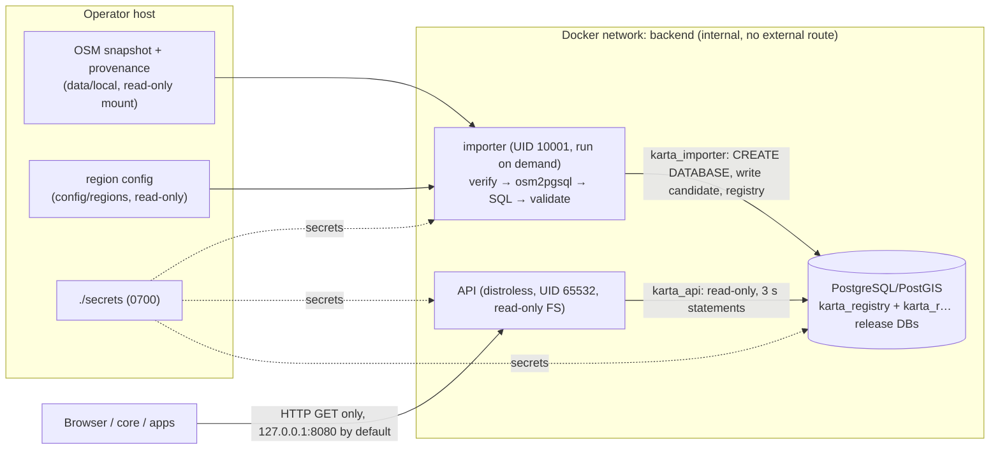

# Data flow, trust boundaries and security assumptions (Stage 1)

## Trust boundaries

| Boundary | Trusted | Controls |
| --- | --- | --- |
| Snapshot file → importer | the operator who places it | regular file only (no symlinks/devices), size limit, SHA-256 against the region's pinned digest, provenance sidecar digest/size/box match, header box must equal the region box, header parsing bounded (PBF blob header ≤ 64 KiB, blob ≤ 32 MiB, protowire decoding, timestamp range), file re-hashed after osm2pgsql to detect modification, osm2pgsql as non-root in a read-only container with a tmpfs |
| Region config → importer | operator | strict JSON (unknown fields rejected), validated ids/boxes/digests; identifiers are never interpolated from free text into SQL |
| Importer → database | importer role | not a superuser: `CREATEDB` only; it owns the registry and the release databases it creates; PostGIS comes from a template created at initialisation |
| API → database | nobody: API input is untrusted | `karta_api` is a member of `karta_reader` with `CONNECT` + `SELECT`/`EXECUTE` only; sessions default read-only at the role, the release database and the connection; `statement_timeout` 3 s (connection) and 5 s (role); only parameterized SQL; release databases are frozen `default_transaction_read_only = on` after import |
| Client → API | untrusted | `GET`/`HEAD`/`OPTIONS` only, bodies rejected, 16 KiB header limit, 5 s header / 10 s read / request deadline, strict parameter validation (unknown or repeated parameters rejected, UTF-8 and control characters checked, bounded lengths and numbers), LIKE metacharacters removed by normalization and escaped again, errors without internal details, access logs without query strings |
| Browser → demo | untrusted page context | CSP `default-src 'none'` with `script-src`/`connect-src` `'self'`, `frame-ancestors 'none'`; MapLibre and fonts served locally; no CDN, OSM tile or Nominatim access |

## Network exposure

* PostgreSQL publishes no port and sits on an `internal` network with no route
  outside Docker. Only the API is published, on `127.0.0.1` by default
  (`KARTA_HTTP_BIND`); put TLS termination in front of it for any other exposure.
* The running API makes no outbound connections: it needs the database and
  nothing else, and keeps answering during an internet outage. `make
  test-offline` runs it with no external route. It checks the container's
  network attachments, the network's `internal` flag, published ports and
  default routes (`scripts/check-isolated.sh`, with a negative control on a
  frontend-like network), and checks the result from the browser's point of
  view too.
* CORS is off unless origins are listed in `KARTA_CORS_ALLOWED_ORIGINS`;
  credentials are never allowed.

## Secrets

Secret *names* are in `.env.example`; values live only in `./secrets/*` (random,
generated locally, git-ignored) and reach containers as Docker secrets. Passwords are
read from files, never put in DSNs, command lines or logs; osm2pgsql receives
the importer password through a temporary 0600 pgpass file. The secret files
are 0644 inside a 0700 directory so the non-root container users can read the
bind-mounted files; on shared hosts or in production use the orchestrator's
secret store with per-service ownership. The database uses SCRAM-SHA-256.

## Containers

API: distroless static image, UID 65532, read-only root filesystem, all
capabilities dropped, `no-new-privileges`, 512 MiB / 1 CPU / 256 PIDs, health
check via the binary itself. Importer: Ubuntu 24.04 + osm2pgsql 1.11.0, UID
10001, read-only root filesystem with a 1 GiB `/tmp` tmpfs, inputs mounted
read-only. PostgreSQL: official PostGIS image (drops to the `postgres` user),
`no-new-privileges`, memory/CPU/PID limits. All images are pinned by digest.

## Deferred to Stage 2 (not available)

The operator write interface (inbox, staging, activation, rollback, status)
does not exist in Stage 1: imports are run explicitly by the operator with
`make import-*`, and replacing a release requires `make reset`. Its
authentication, audit and inbox threat model are Stage 2 work. The registry's
`events` table already records import start, failure and activation.

## Known limitations

* No TLS inside the Docker network (`KARTA_DB_SSLMODE=disable`); set
  `verify-full` when PostgreSQL runs on another host.
* No rate limiting in the API; put a reverse proxy with limits in front of
  public deployments. Expensive queries are bounded by the statement timeout.
* `govulncheck` needs vuln.go.dev; it runs in CI (see the PR for what could be
  run in the implementation environment).
